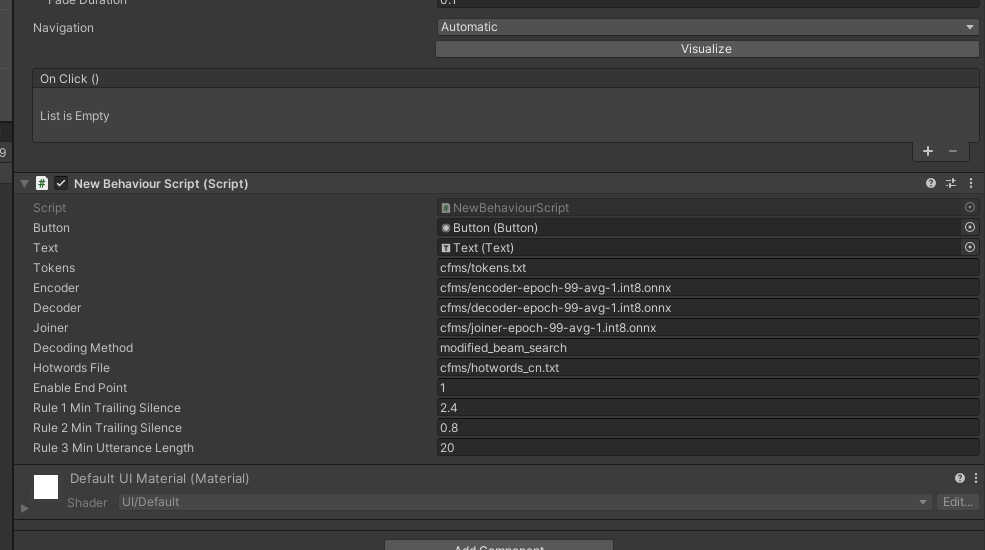
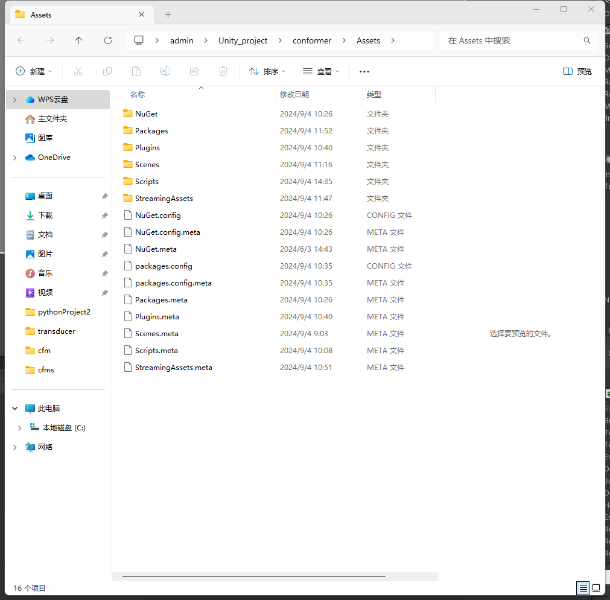
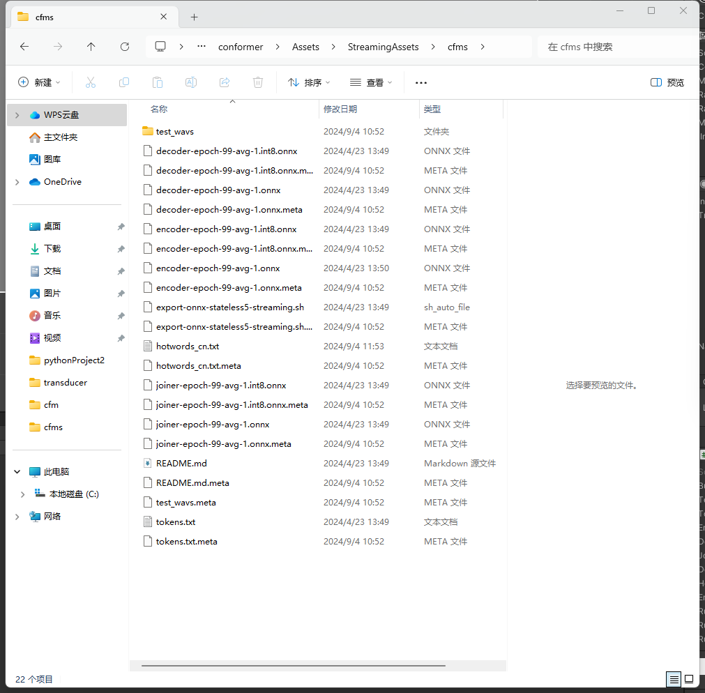

# Sherpa-onnx-Unity

Unity 中使用 Sherpa-onnx(附带热词功能)

## 项目来源

本项目来源于新一代 kaldi 团队开发的开源语音识别框架 Sherpa-onnx。已经有了前一个版本 Sherpa-ncnn 的 Unity 案例，这里补充 Sherpa-onnx 的：

- 源项目地址: [https://github.com/k2-fsa/icefall](https://github.com/k2-fsa/icefall)

## 参考项目

本项目的开发过程中参考了以下项目：

- 参考地址: [https://github.com/ssssssilver/sherpa-ncnn-unity](https://github.com/ssssssilver/sherpa-ncnn-unity)
- 官方文档：[https://k2-fsa.github.io/sherpa/intro.html](https://k2-fsa.github.io/sherpa/intro.html)

## 使用说明

为了能够正常使用本项目，请按照以下步骤进行操作：

### a. 下载 NuGet 包并导入 DLL 到 Plugins 文件夹中

请访问 NuGet 官网或其他途径搜索关键词 Sherpa-onnx 下载所需的 NuGet 包，并将其包含的 DLL 文件复制到项目的`Plugins`文件夹内。

### b. 从 Sherpa-Onnx 官方处下载支持热词功能的模型

前往 Sherpa-Onnx 官方网站或指定位置下载带有热词功能的模型文件，并将其放置在项目的`StreamingAssets`文件夹下。
例如你下载的模型叫做”zipformer“，里面有 encoder、decoder 等模型文件。那么就将 zipformer 文件夹放到 StreamingAssets 文件下。

### c. 填写路径信息（不要有中文路径）

然后按照所需变量，添加模型文件。

## 感谢新一代 kaldi 团队开发）
